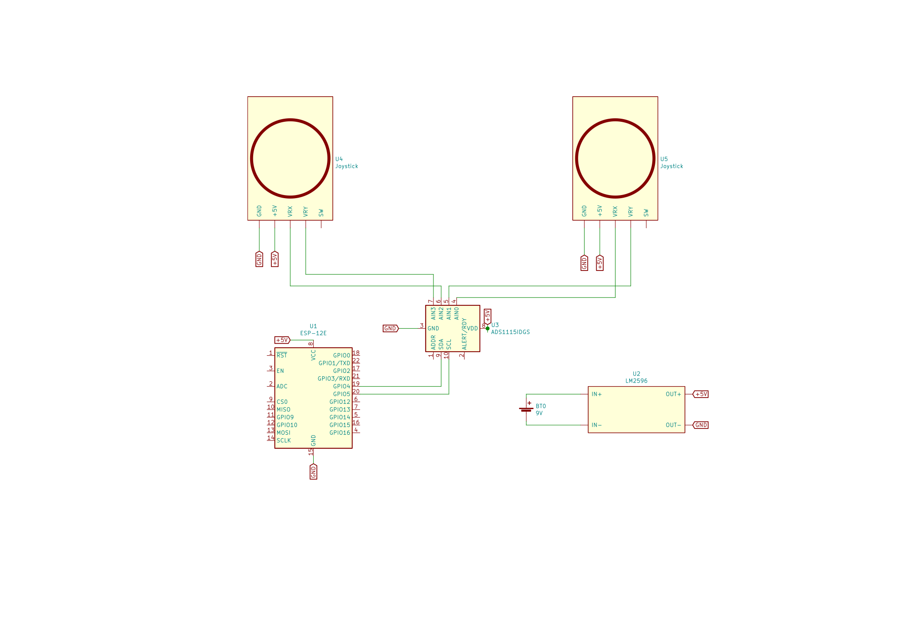

DIY Remote Control 
------------------

**Hardware-List:**

| Item                       | Description              |
|----------------------------|--------------------------|
| (2x) NodeMCU - ESP8266-12e | Processor / WiFi-Modul   |
| (1x) ADS1115               | 16Bit - 4-channel ADC IC |
| (2x) Joystick              | 2-axis Potentiometer     |
| (1x) LM2596                | DC-DC Converter          |
| (1x) 9V Battery            |                          |

